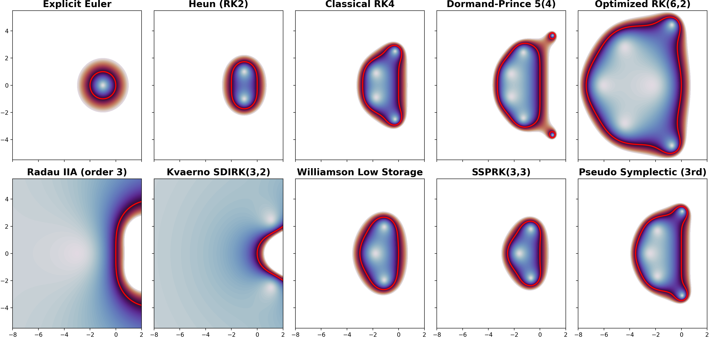

# rk-stability-explorer

Stability analysis and visualization tools for Runge–Kutta methods using Butcher tableaux.



Runge–Kutta methods are some of the brightest gems of numerical analysis —
but picking one blindly is still a great way to end up in numerical hell.

This repo is a small playground to answer a simple question:

> *what does the stability region actually look like?*

---

## ⚡ 30-second demo

```bash
pip install --upgrade --no-cache-dir git+https://github.com/hardware-numerics/rk-stability-explorer.git

rk-stability plot rk4 heun
```

This opens a stability plot comparing two classical methods.

---

## 🔥 What’s inside

A minimal (and intentionally lightweight) setup to:

* compute **stability regions** for Runge–Kutta methods
* plug in **arbitrary Butcher tableaux**
* compare schemes without committing to a full solver stack

---

## 📦 Installation

From GitHub:

```bash
pip install --upgrade --no-cache-dir git+https://github.com/hardware-numerics/rk-stability-explorer.git
```

Specific version:

```bash
pip install --upgrade --no-cache-dir git+https://github.com/hardware-numerics/rk-stability-explorer.git@v0.1.0
```

---

## 🧪 Installation in virtual environment

To use the package inside a virtual environment:

```bash
mkdir ~/apps
mkdir ~/apps/myutil
cd ~/apps/myutil
virtualenv .env
source .env/bin/activate
pip install --upgrade --no-cache-dir git+https://github.com/hardware-numerics/rk-stability-explorer.git
```

---

## 🚀 Quick usage

List available methods:

```bash
rk-stability list
```

Show a method (Butcher tableau):

```bash
rk-stability show rk4
```

Plot stability regions:

```bash
rk-stability plot rk4 heun
```

Multiple methods:

```bash
rk-stability plot rk4 heun radauIIA --cols 3
```

Save to file:

```bash
rk-stability plot rk4 heun --save rktest.png
```

---

## 📊 About plotting behavior (CLI)

* By default, plots are shown interactively

* The process waits until the plot window is closed

* When using `--save`, the plot is briefly displayed (~1 second)
  before being saved — just to indicate that something is happening

If you interrupt (`Ctrl+C`), you may see a `KeyboardInterrupt` message — this is expected.

---

## 🖼 Example


Top row: stability regions growing left → right.
Translation: larger timesteps, fewer regrets.

---

## ⚔️ Choose your fighter

A curated mix of methods — from well-behaved classics to more… opinionated schemes:

**The usual suspects**

* Euler
* Heun
* RK4

**Accuracy with supervision**

* Dormand–Prince (embedded pair)

**Heavy artillery (stiff problems)**

* Gauss–Legendre
* Radau

**Specialized operators**

* SSP (for when monotonicity matters)
* Williamson low-storage (when memory is tight)
* SDIRK (for those who like compromises)
* Pseudo-symplectic (a real diamond)

---

## 🧪 What you can do here

* Visualize stability regions
* Compare methods side by side
* Stress-test schemes against your intuition
* Drop in your own RK method and see if it survives

---

## 🧾 Bring your own method

All methods are defined via **Butcher tableaux** in YAML.

It’s simple, explicit, and slightly annoying —
which is exactly what you want when things start breaking.

---

## 📚 Tutorials & demos

* `notebooks/rk-basic-tutorial.ipynb` — interactive walkthrough
* `notebooks/demo.py` — demo script
* `rk_stability_explorer/` — core logic
* `rk_stability_explorer/methods/` — method definitions

---

## 🎓 Why this exists

Originally developed for a course on advanced numerical methods.

Because stability regions are too important to stay abstract —
and too fun not to plot.

---

## 💬 Final note

If your favorite RK method is missing — add it.

The package is experimental, intentionally lightweight, and built for exploration.
Students from *Advanced Numerical Methods for Physics and Medical Physics* (SoSe 2026, HHU)
are especially welcome to contribute :)

